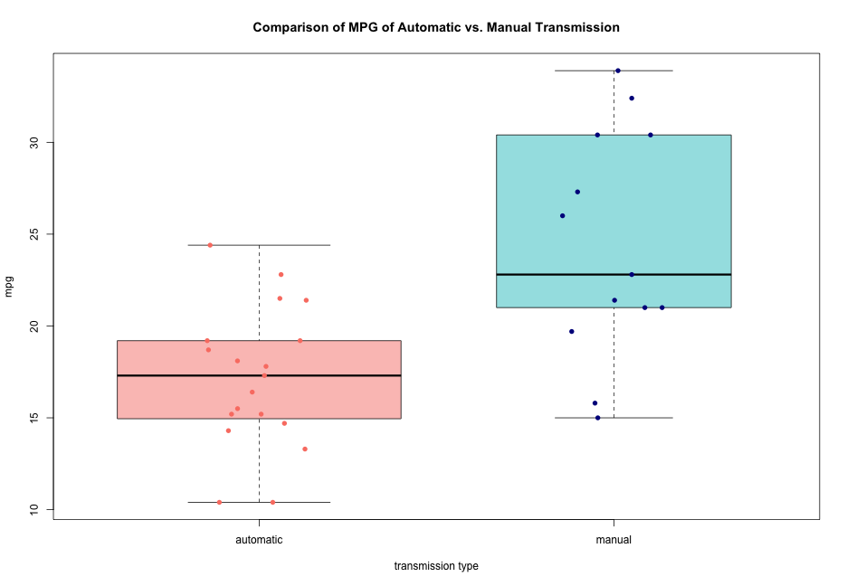
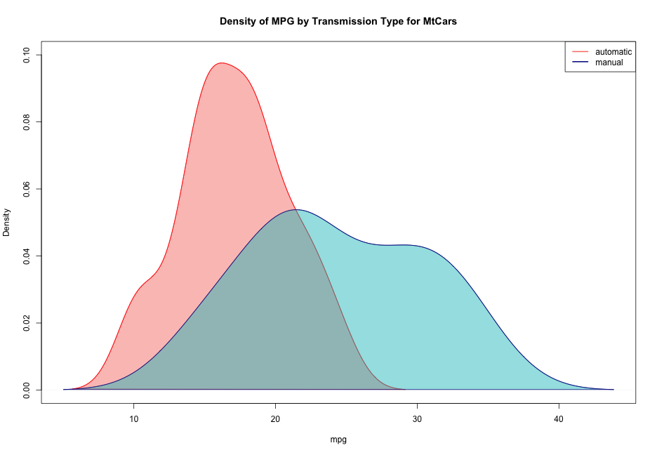
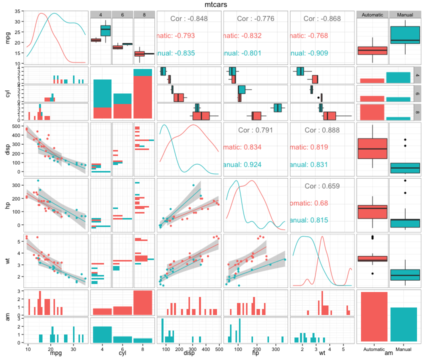
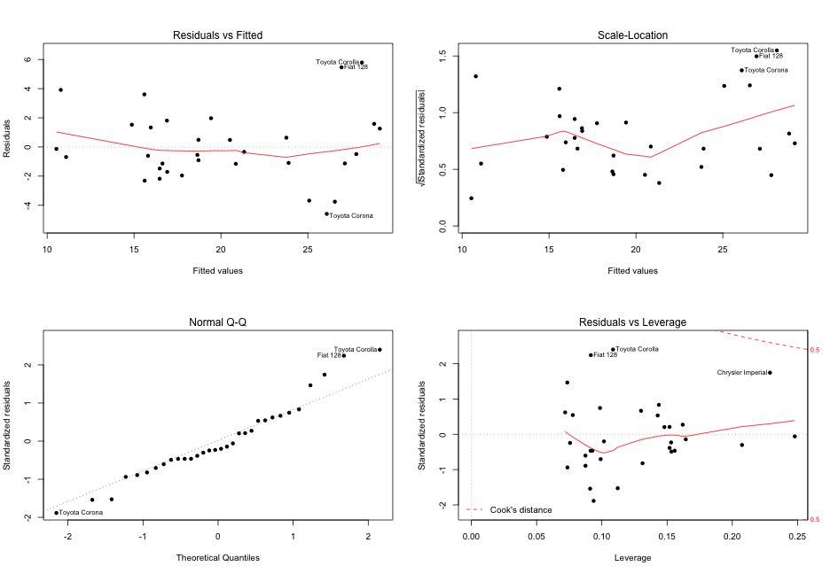
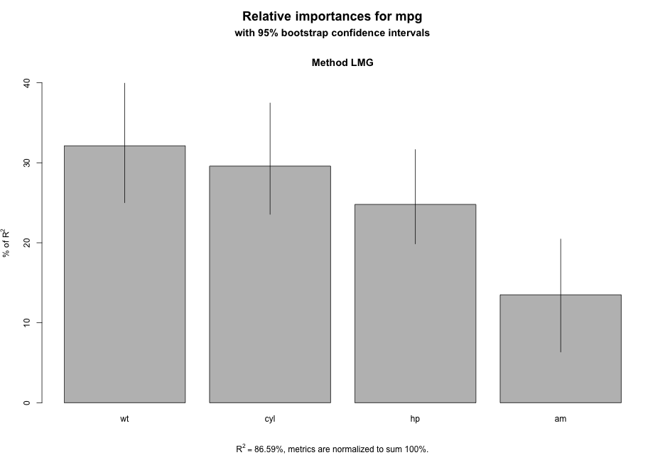

library(knitr)
knit2html("projectRegression.Rmd")

---
title: "The Relationship Between Miles per Gallon and Transmission Type"
author: "John Slough II"
date: "12 Jan 2015"
output: html_document
---
**Executive Summary**

From our analysis of the mtcars dataset, we have determined that in general  manual transmissions are better in terms of miles per gallon than automatic transmissions.   In a linear regression model with only transmission type as an explanatory variable, a change from automatic to manual transmission increased the mpg by 7.245 however, transmission type only explained 36% of the variation in mpg.  A linear regression model of all significant variables (determined by ANOVA), explained 84% of the variation in mpg. It included only the variables weight and number of cylinders.  Transmission type was determined to be an insignificant contributory variable to the model.  Furthermore, when transmission type was included in the model, a Bootstrap Measures of Relative Importance showed that it only contributed only about 14% to the r^2^ of 87%.  It is recommended that the editors of *Motor Trend* consider the varibles weight, number of cylinders, and possibly horsepower as the most significant explanatory variables of miles per gallon.

**Report**


**The Data**

We are to investigate the relationship between miles per gallon (numerical class variable, mpg) and a set of explanatory variables.  The explanatory variables and their classes are:

1. cyl: number of cylinders (factor, 4,6,8)
2. disp: displacement (cu.in.) (numerical)
3. hp: gross horsepower (numerical)
4. drat: rear axle ratio (numerical)
5. wt: weight (1000 pounds) (numerical)
6. qsec: 1/4 mile time (numerical)
7. vs: V/S, V-engine or Straight engine (factor, V,S)
8. am: transmission type (factor, automatic, manual)
9. gear: number of forwards gears (factor, 3,4,5)
10. carb: number of carburetors (factor, 1,2,3,4,5,6,7,8)

**Data Processing**

We will remove the variable qsec, 1/4 mile time, as this is not a reasonable explanatory variable for mpg and is better seen as another outcome variable. In addition, it is necessary to code the variables with their proper class (factor, numerical.)

**Exploratory Data Analysis**

First we must determine whether or not there is actually a difference between automatic and manual transmissions in terms of mpg.  The following boxplot appears to show that there is a difference.  

 


Another way to view the difference between automatic and muanual transmissions' mpg is with a density plot.  The plot below shows the two densities of automatic and manual transmissions.  Again, it appears that the manual cars tend to have a higher mpg, but with more variation.


 


To be sure that the means are different, we can perform a t-test.  The t-test results in a p-value of 0.0013736.  This means that we reject the null hypothesis that the means are similar.

Pairs Plot

The following is a chart plotting the more significant variables against each other (as determined by the models below).  We can see that there are correlations between many variables therefore multicollinearity may be an issue.  It is color-coded by transmission type.  

 

**Building the Model**

We can now turn towards building the regression model for this dataset.  We will first use multiple linear regression and the R "step" function, which chooses the optimal model by AIC (Aikake Information Criterion).  With mpg as the outcome variable and all other variables, except 1/4 mile, as the explanatory variables we arrive at the model:


```
## (Intercept)        cyl6        cyl8          hp          wt    amManual 
##      33.708      -3.031      -2.164      -0.032      -2.497       1.809
```

and the coefficients' corresponding p-values:

```
## (Intercept)        cyl6        cyl8          hp          wt    amManual 
##     0.00000     0.04068     0.35225     0.02693     0.00908     0.20646
```

The model here is: mpg ~ cyl + hp + wt + am.
The r^2^ for this model is 0.866 which means that this model explains 86.6% of the variation in mpg.  The model, arrived at by AIC, includes the variable am, or transmission type. The coefficient for am is 1.809, which we can interepret as, when other variables are held constant, a change from automatic to manual transmission will increase the mpg by 1.809.  However, we must note the p-value associated with the transmission type variable.  It is 0.206 which is well above our usual 0.05 significant level.   

If we remove the transmission type from this model, and refit it we obtain a model mpg ~ cyl + hp + wt.  The coefficients and corresponding p-values are: 

```
## (Intercept)        cyl6        cyl8          hp          wt 
##      35.846      -3.359      -3.186      -0.023      -3.181
```

```
## (Intercept)        cyl6        cyl8          hp          wt 
##     0.00000     0.02375     0.15370     0.06361     0.00014
```

An ANOVA test between this model and this previous results in a p-value of 0.206 which means that we should choose the simpler model.  However, we can further simplify the model by removing the hp or horsepower variable since the p-value for its coefficient is above 0.05. This results in the model mpg ~ cyl + wt.  An ANOVA test between this model and previous two models resulted in p-values of 0.064 and 0.082, respectively.  Both are above 0.05 so we can choose the simpler model.  
The final model is:

```
## 
## Call:
## lm(formula = mpg ~ cyl + wt, data = mtcars)
## 
## Residuals:
##     Min      1Q  Median      3Q     Max 
## -4.5890 -1.2357 -0.5159  1.3845  5.7915 
## 
## Coefficients:
##             Estimate Std. Error t value Pr(>|t|)    
## (Intercept)  33.9908     1.8878  18.006  < 2e-16 ***
## cyl6         -4.2556     1.3861  -3.070 0.004718 ** 
## cyl8         -6.0709     1.6523  -3.674 0.000999 ***
## wt           -3.2056     0.7539  -4.252 0.000213 ***
## ---
## Signif. codes:  0 '***' 0.001 '**' 0.01 '*' 0.05 '.' 0.1 ' ' 1
## 
## Residual standard error: 2.557 on 28 degrees of freedom
## Multiple R-squared:  0.8374,	Adjusted R-squared:   0.82 
## F-statistic: 48.08 on 3 and 28 DF,  p-value: 3.594e-11
```
Here, all of the coefficients are highly significant.  This model has an r^2^ of 0.837 which means that it explains 83.7% of the variation in mpg.  This is very close to our original model with 2 more variables.  Note that transmission type is not included in the final model.

The plots below are the diagnostic plots for the model.  There do not appear to be any problems with these plots; the residuals appear randomly, the standardized residuals appear normally distributed, and there are not any highly influential outliers. 


 


**Model with only Transmission Type**


The project asks us about two specific points: 

1. Is an automatic or manual transmission better for MPG?

2. Quantify the MPG difference between automatic and manual transmissions

We have seen in the explaoratory data analysis section that manual transmissions are generally better for mpg.  To quantify the difference, a linear model was fit using only mpg as an explanatory variable.  This model produced an 0.36 which means that it explains 36% of the variation in mpg, much less than the final model arrived at above.  The coefficient is significant, and at 7.245, which we can interepret as, automatic to manual transmission will increase the mpg by 7.245.  Sounds like transmission type does have an impact on mpg, however when the previous models are considered, other variables are much more impartant than transmission type in explaining the variation in mpg. An ANOVA between this model and the final model above results in a p-value of less than 0.0000001 which means that we reject the null hypothesis that the models are similar.  We must use the more complex model, as it explains a significantly higher proportion of variation in mpg than the simpler model.  

**Relative Importance of Variables**

For our last analysis we will look at Bootstrap Measures of Relative Importance of explanatory variables.  This is a nice way to interpret the importance of variables with regard to their contribution to the r^2^ of a model. We used the model fit by AIC which includes the variables cylinder, horsepower, weight, and transmission type. The results are shown in the plot below.  We can clearly see that am, transmission type, is the least important of these variables contributing only about 14% to the r^2^.  

 


**Conclusion**

We have determined that there is a difference in mpg in relation to transmission type and have quantified that difference. However, transmission type does not appear to be a very good explanatory variable for mpg; weight, horsepower, and number of cylinders are all more significant variables.  

**R-code**

Available at: https://github.com/SloughJE/Cousera-Regression-Models
